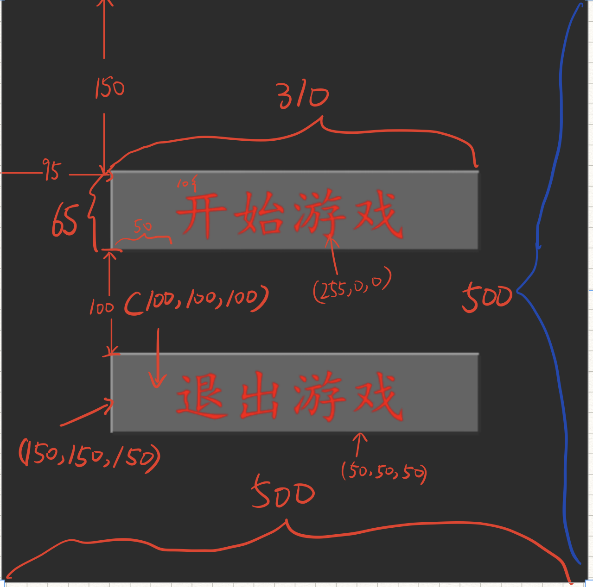

# Introduction
```
重庆工商大学19级2019~2020年资助性发展项目
```

# Environment(Tested)
```
OS: Windows10
Python: Python3.5+(have installed necessary dependencies)
```

# Usage
```
Step1:
pip install -r requirements.txt
Step2:
run "python main.py"
```

# Game Display


# 过关视频


# 细节

## 初始化游戏
```python
pygame.init() # pygame初始化
# pygame.mixer.init() # 音效初始化
pygame.display.set_caption('推箱子小游戏') # 设置游戏标题
screen = pygame.display.set_mode([Config.get('WIDTH'), Config.get('HEIGHT')]) #设置游戏大小
pygame.mixer.init()
```

## 音频文件
``` Python
from config import Config # 配置文件导入

audio_path = os.path.join(Config.get('resources_path'), Config.get('audiofolder'), 'EineLiebe.mp3') # 路径拼接
pygame.mixer.music.load(audio_path)
pygame.mixer.music.set_volume(0.4)
pygame.mixer.music.play(-1)
```

## 业务逻辑
### 0.通用接口
1. 退出游戏
``` Python
def quitGame():
    '''退出游戏'''
    pygame.quit()
    sys.exit(0)
```

## 1.开始页面

1. 主要业务逻辑
``` Python
def startInterface(screen):
    '''开始界面'''
    screen.fill(Config.get('bg_color'))
    clock = pygame.time.Clock()
    while True:
        button_1 = BUTTON(screen, (95, 150), '开始游戏')  # TODO 观察button的实现
        button_2 = BUTTON(screen, (95, 305), '退出游戏')
        # 事件处理
        for event in pygame.event.get():
            if event.type == pygame.QUIT:
                pygame.quit()
                sys.exit()
            if event.type == pygame.MOUSEBUTTONDOWN:
                if button_1.collidepoint(pygame.mouse.get_pos()):  # 碰撞检测
                    return  # 如果点击了开始游戏则退出开始页面逻辑
                elif button_2.collidepoint(pygame.mouse.get_pos()):
                    quitGame()  # 如果点击了退出游戏则执行退出游戏逻辑
        clock.tick(60)
        pygame.display.update()
```
2. 绘制按钮接口
``` Python
def BUTTON(screen, position, text, bwidth=310, bheight=65):
    """定义按钮
    Args:
            screen: 被画按钮的surface对象,
            position: 在screen对象上画的位置
            text: 画的文本内容
    return:
            按钮在screen上的react对象,记录位置,用于做碰撞检测
    """
    line_width = 5
    left_top_colour = (150, 150, 150)
    right_down_colour = (50, 50, 50)
    fill_colour = (100, 100, 100)
    font_colour = (255, 0, 0)
    font_size = 50
    left, top = position  # 拆包
    pygame.draw.line(screen, left_top_colour, (left, top),
                     (left+bwidth, top), line_width)  # 上方的线
    pygame.draw.line(screen, left_top_colour, (left, top-2),
                     (left, top+bheight), line_width)  # 左边的线
    pygame.draw.line(screen, right_down_colour, (left, top+bheight),
                     (left+bwidth, top+bheight), line_width)  # 右边的线
    pygame.draw.line(screen, right_down_colour, (left+bwidth,
                                                 top+bheight), [left+bwidth, top], line_width)  # 下班的线
    pygame.draw.rect(screen, fill_colour, (left, top, bwidth, bheight))
    font_path = os.path.join(Config.get(
        'resources_path'), Config.get('fontfolder'), 'simkai.ttf')
    font = pygame.font.Font(font_path, font_size)
    text_render = font.render(text, True, font_colour)
    return screen.blit(text_render, (left+50, top+10))  # 画一个按钮

```


# 笔记
## 字典
1. 字典中的 dict[key]和dict.get(key)的区别
```python
dict = {1:"haha",2:"zhazha"}
dict[1] -> haha
dict.get(2) -> zhazha
```
当遇到不存在的key的时候
``` Python
dict = {1:"haha",2:"zhazha"}
dict[0] -> 报错
dict.get(0) -> None
```
2. 颜色grb颜色数值越高,颜色越亮,在绘制按钮的时候,通过颜色由浅入深形成立体感

3. 判断某位置是否可以到达,R
``` Python
Rect.collidelist()
检测该 Rect 对象是否与列表中的任何一个矩形有交集。
Rect.collidelist(list) -> index
返回值是第 1 个有相交的矩形所在列表中的索引号（如果有的话），否则返回 -1。
```
 

3. 迭代器与生产器


4. 透明度分析
Pygame支持三种类型的透明度分析：colorkeys，surface alphas 和 pixel alphas
- colorkeys 指定一种颜色,让它变为透明
- surface alphas 给整体设置一个透明度
- pixel alphas 给每个像素点设置一个alphas通道,让图片支持透明通道
convert() 转换的图片可以支持colorkeys和surface
convert_alpha() 转换后的图片可以支持 pixel alphas

5. Surface.get_at(x,y) -> Color:
> 返回该点（x, y）下的Color对象 --> 可用于设置透明颜色值

